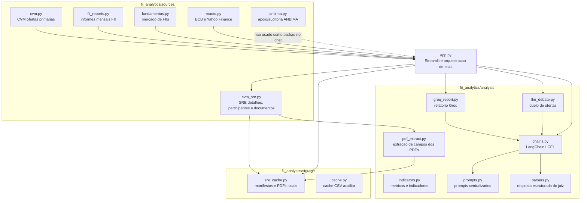
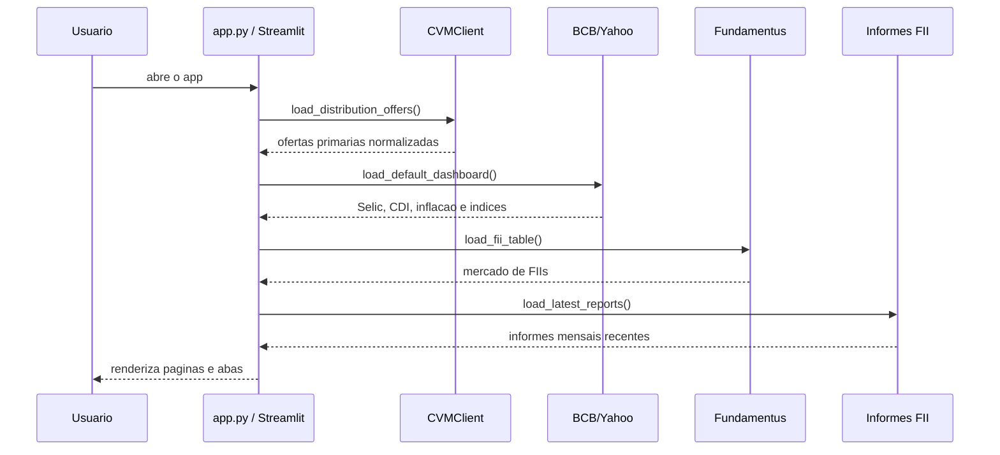
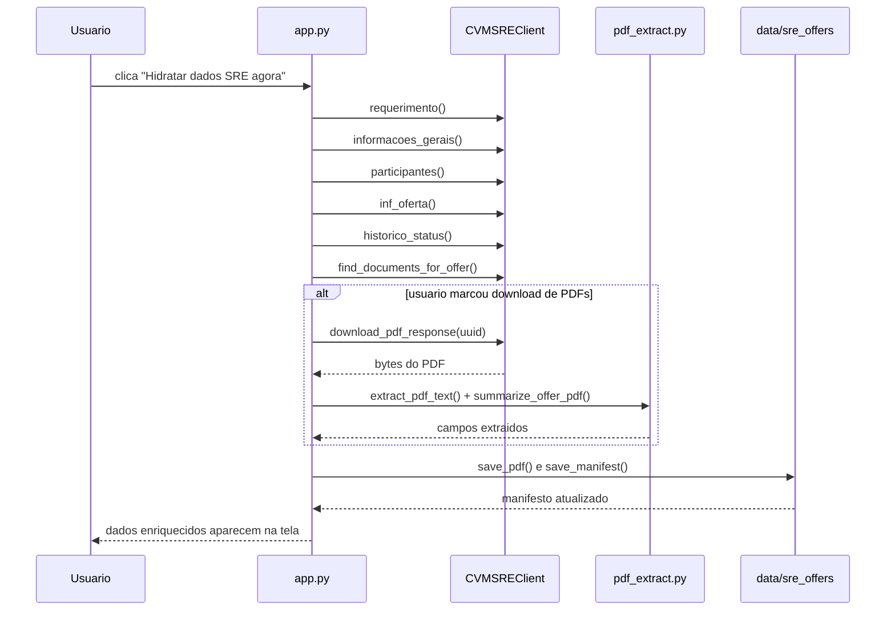
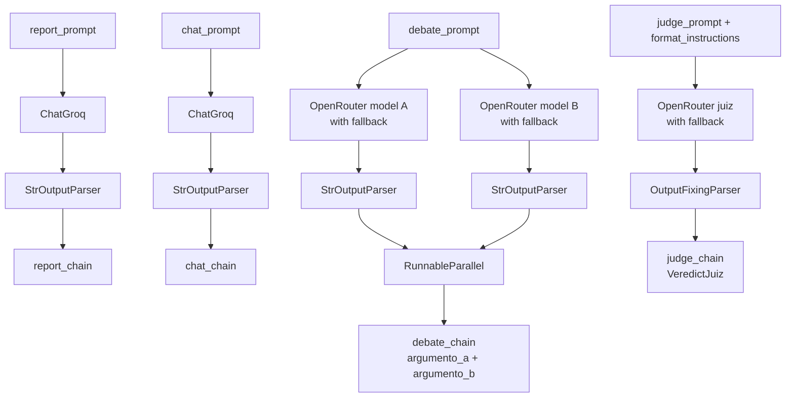
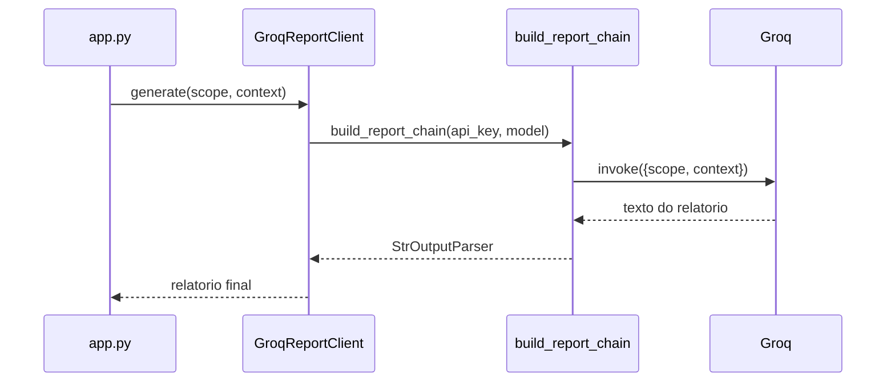
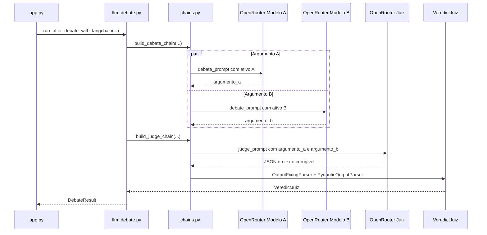

# Oferta.Ai: Arquitetura Tecnica

Este documento descreve como o Oferta.Ai esta orquestrado internamente. Ele complementa `docs/projeto_fluxo.md`: o outro arquivo explica o fluxo em linguagem mais natural; este aqui mostra modulos, responsabilidades, contratos de dados e uso do LangChain.

## 1. Visao Geral da Orquestracao

O projeto e uma aplicacao Streamlit com uma camada de fontes de dados, uma camada de armazenamento local, uma camada de analise e uma camada de IA. O `app.py` e o orquestrador principal: ele carrega os dados, aplica filtros, renderiza telas, chama a hidratacao SRE quando o usuario pede e aciona as chains de IA quando necessario.



## 2. Entrada da Aplicacao

O Streamlit comeca em `app.py`.

Pontos principais:

- `st.set_page_config(page_title="Oferta.Ai", layout="wide")` define o nome da aplicacao e o layout.
- As funcoes `load_*` usam `st.cache_data` para reduzir chamadas externas durante a sessao.
- `PRIMARY_PRODUCT_TABS` define as abas principais suportadas: FII, CRI, CRA, Debentures e IPO.
- O menu lateral escolhe entre as paginas principais: painel, detalhe do ativo, duelo de ativos e chat Groq.
- A aplicacao carrega primeiro CVM, macro, Fundamentus e informes FII; se alguma fonte falha, ela segue com tabela vazia e exibe aviso.

Fluxo inicial simplificado:



## 3. Fontes de Dados

### 3.1 CVM Ofertas Primarias

Arquivo: `fii_analytics/sources/cvm.py`

Responsabilidade:

- Baixar o ZIP oficial de ofertas de distribuicao da CVM.
- Ler o CSV interno.
- Normalizar nomes de colunas e datas.
- Filtrar ofertas relacionadas a produtos suportados.

Uso principal:

- `CVMClient().load_distribution_offers()` carrega a base completa de ofertas.
- `load_cvm_primary_offers()` em `app.py` filtra `Tipo_Oferta == "PRIMARIA"`.
- `offers_for_product(...)` separa os dados nas abas FII, CRI, CRA, Debentures e IPO.

### 3.2 CVM SRE

Arquivo: `fii_analytics/sources/cvm_sre.py`

Responsabilidade:

- Consultar endpoints publicos do SRE para uma oferta especifica.
- Buscar dados de requerimento, informacoes gerais, participantes, historico, documentos e PDFs.
- Extrair UUIDs de documentos quando a resposta vem em estruturas diferentes.

O SRE nao e carregado automaticamente para todas as ofertas no primeiro acesso. Ele e usado quando o usuario clica em hidratar ou quando um manifesto local ja existe.

### 3.3 PDFs das Ofertas

Arquivo: `fii_analytics/analysis/pdf_extract.py`

Responsabilidade:

- Ler bytes do PDF.
- Extrair texto com `pypdf`.
- Procurar campos como preco de emissao, taxa/remuneracao, valor total, publico alvo, coordenador, destinacao dos recursos e fatores de risco.

Esses campos entram em `pdf_summaries` dentro do manifesto local da oferta.

### 3.4 FIIs e Mercado

Arquivos:

- `fii_analytics/sources/fii_reports.py`
- `fii_analytics/sources/fundamentus.py`

Responsabilidade:

- Informes mensais da CVM: historico patrimonial, rentabilidade e dados do fundo.
- Fundamentus: cotacao, dividend yield, P/VP, liquidez e ranking de FIIs.

Esses dados sao mais importantes nas telas de FII e nas comparacoes versus indices.

### 3.5 Macro e Indices

Arquivo: `fii_analytics/sources/macro.py`

Responsabilidade:

- Banco Central: series como Selic, CDI, IPCA e IGP-M.
- Yahoo Finance: IFIX, IMOB e Ibovespa.

O topo macro do painel mostra variacao com seta verde para alta e seta vermelha para baixa.

### 3.6 ANBIMA

Arquivo: `fii_analytics/sources/anbima.py`

Responsabilidade atual:

- Manter cliente e endpoints de apoio/auditoria para dados ANBIMA.
- O chat nao usa ANBIMA como fonte padrao para taxas, porque o foco definido e oferta primaria CVM/SRE/PDF, nao mercado secundario.

## 4. Armazenamento Local

### 4.1 Manifesto SRE

Arquivo: `fii_analytics/storage/sre_cache.py`

Raiz local:

```text
data/sre_offers/{Numero_Requerimento}/manifest.json
data/sre_offers/{Numero_Requerimento}/pdfs/*.pdf
```

O manifesto guarda:

- campos originais da CVM em `cvm`;
- documentos encontrados em `documents`;
- participantes em `participants`;
- informacoes complementares do SRE em `inf_offer`, `requerimento`, `informacoes_gerais` e `historico_status`;
- erros de hidratacao em `errors`;
- PDFs baixados em `downloaded_pdfs`;
- campos extraidos dos PDFs em `pdf_summaries`.

### 4.2 Fluxo de Hidratacao SRE no Streamlit

Funcoes centrais em `app.py`:

- `hydrate_sre_offer(...)`
- `render_sre_hydration_button(...)`
- `render_sre_offer_enrichment(...)`
- `render_cached_sre_data(...)`



Existe tambem `scripts/hydrate_sre_cache.py`, que executa a mesma ideia em lote via terminal. Ele e util quando se quer hidratar varias ofertas sem usar a interface.

## 5. Telas e Responsabilidades do app.py

### 5.1 Painel Inicial

Renderizacao:

- `render_macro_top(...)`
- `render_primary_product_tab(...)`
- `render_primary_fii_offers_table(...)`
- `render_sre_offer_enrichment(...)`
- `render_groq_analytical_report(...)`

Responsabilidade:

- Mostrar dados macro.
- Separar ofertas por produto.
- Permitir hidratacao SRE.
- Mostrar tabelas, graficos, resumo de fonte e relatorio analitico Groq.

### 5.2 Detalhe do Ativo

Renderizacao:

- `render_detail_page(...)`
- `render_detail_product_tab(...)`
- `render_asset_index_comparison(...)`
- `render_offer_index_comparison(...)`
- `render_fii_radar_comparator(...)`
- `render_offer_radar_comparator(...)`

Responsabilidade:

- Comparar FII com indices.
- Comparar CRI, CRA, Debentures e IPO com indicadores de atividade/oferta.
- Mostrar radar por atributos normalizados.
- Mostrar narrativa do ativo quando aplicavel.

### 5.3 Duelo Ativos

Renderizacao:

- `render_llm_debate_page(...)`
- `run_llm_offer_debate(...)`

Responsabilidade:

- Selecionar duas ofertas do mesmo grupo.
- Compactar dados de cada oferta.
- Rodar dois modelos defensores em paralelo via LangChain.
- Rodar um juiz via OpenRouter.
- Exibir argumento A, argumento B e decisao estruturada.

### 5.4 Chat Groq

Renderizacao:

- `render_groq_chat_page(...)`
- `build_platform_chat_context(...)`
- `append_primary_offer_rates_context(...)`

Responsabilidade:

- Receber pergunta natural do usuario.
- Buscar ofertas relevantes pelo texto da pergunta.
- Incluir dados macro, FIIs, informes e SRE/PDF quando houver.
- Priorizar taxas e remuneracoes de ofertas primarias.
- Chamar `build_chat_chain().invoke(...)`.

O chat nao pede chave de API na tela. A chave vem do `.env`.

## 6. Camada LangChain

Arquivos:

- `fii_analytics/analysis/chains.py`
- `fii_analytics/analysis/prompts.py`
- `fii_analytics/analysis/parsers.py`
- `fii_analytics/analysis/groq_report.py`
- `fii_analytics/analysis/llm_debate.py`

A integracao com LangChain foi feita apenas na camada de IA. Fontes de dados, ingestao CVM/SRE, extracao de PDF e armazenamento local continuam fora do LangChain.

### 6.1 Modelos Instanciados

Arquivo: `fii_analytics/analysis/chains.py`

Groq:

```python
ChatGroq(
    api_key=current_groq_api_key(...),
    model=settings.groq_report_model or "llama-3.3-70b-versatile",
    temperature=0.2,
)
```

OpenRouter:

```python
ChatOpenAI(
    base_url="https://openrouter.ai/api/v1",
    api_key=settings.openrouter_api_key,
    model=model,
    default_headers={
        "HTTP-Referer": "http://localhost:8502",
        "X-Title": "Oferta.Ai",
    },
)
```

`current_groq_api_key(...)` recarrega o `.env` com `override=True` antes de cada chamada Groq. Isso permite trocar `GROQ_API_KEY` manualmente no `.env` e usar a nova chave nas proximas chamadas.

### 6.2 Prompts

Arquivo: `fii_analytics/analysis/prompts.py`

Prompts exportados:

- `report_prompt`: relatorio analitico de mercado/oferta.
- `chat_prompt`: chat natural com os dados da plataforma.
- `debate_prompt`: defesa de uma oferta contra outra.
- `judge_prompt`: julgamento estruturado dos argumentos.

Placeholders principais:

```text
report_prompt:
  {scope}
  {context}

chat_prompt:
  {chat_history}
  {question}
  {context}

debate_prompt:
  {asset_text}
  {opponent_text}

judge_prompt:
  {asset_1_name}
  {asset_2_name}
  {argumento_a}
  {argumento_b}
  {format_instructions}
```

### 6.3 Chains Exportadas

Arquivo: `fii_analytics/analysis/chains.py`



Chains:

- `report_chain = report_prompt | groq_llm | StrOutputParser()`
- `chat_chain = chat_prompt | groq_llm | StrOutputParser()`
- `debate_chain = RunnableParallel(...)`
- `judge_chain = judge_prompt | judge_llm.with_fallbacks(...) | fixing_parser`

O codigo tambem exporta builders:

- `build_report_chain(...)`
- `build_chat_chain(...)`
- `build_debate_chain(...)`
- `build_judge_chain(...)`

Esses builders permitem usar chave/modelo especificos vindos da tela de duelo ou de configuracao sem mudar a interface publica do restante do app.

### 6.4 Relatorio Groq

Arquivo: `fii_analytics/analysis/groq_report.py`

Classe:

- `GroqReportClient`

Fluxo:



Contrato de entrada:

```python
{
    "scope": "...",
    "context": "..."
}
```

Contrato de saida:

```python
"texto final do relatorio"
```

### 6.5 Chat Groq

O chat e chamado diretamente em `app.py`:

```python
answer = build_chat_chain().invoke(
    {
        "chat_history": ...,
        "question": question,
        "context": context,
    }
)
```

Antes da chamada, o app monta o contexto com:

- ofertas CVM mais relevantes;
- dados SRE locais, se existirem;
- campos extraidos de PDF, se existirem;
- dados de FIIs/Fundamentus quando a pergunta parece relacionada;
- informes mensais quando relevantes;
- macro atual;
- bloco especial de taxas de ofertas primarias para perguntas sobre banco, coordenador, ativo ou taxa.

O prompt instrui o modelo a responder de forma natural e nao mencionar mercado secundario, a menos que o usuario peca isso explicitamente.

### 6.6 Duelo e Juiz

Arquivo: `fii_analytics/analysis/llm_debate.py`

Funcao principal:

- `run_offer_debate_with_langchain(...)`

Fluxo:



### 6.7 Parser Estruturado do Juiz

Arquivo: `fii_analytics/analysis/parsers.py`

Modelo Pydantic:

```python
class VeredictJuiz(BaseModel):
    vencedor: str
    ativo_vencedor: str
    resumo: str
    criterios: list[dict[str, Any]]
    pontos_fortes_a: list[str]
    pontos_fortes_b: list[str]
    fragilidades_a: list[str]
    fragilidades_b: list[str]
    alerta: str
```

Parsers:

- `verdict_parser = PydanticOutputParser(pydantic_object=VeredictJuiz)`
- `fixing_parser = OutputFixingParser.from_llm(parser=verdict_parser, llm=_openrouter_judge_llm())`

O objetivo e evitar que o app mostre erro quando o juiz retorna JSON quebrado, truncado ou com texto extra. O `OutputFixingParser` tenta corrigir a resposta para o formato esperado antes de entregar ao Streamlit.

Existe uma classe de compatibilidade local para `OutputFixingParser` quando a versao instalada do LangChain nao disponibiliza o import antigo.

## 7. Contratos de Dados Importantes

### 7.1 Oferta CVM

Campos frequentemente usados:

```text
Numero_Requerimento
Numero_Processo
Data_requerimento
Data_Registro
Data_Encerramento
Status_Requerimento
Valor_Mobiliario
Tipo_Oferta
Nome_Emissor
Nome_Lider
Qtde_Total_Registrada
Valor_Total_Registrado
Publico_alvo
Regime_distribuicao
Bookbuilding
Destinacao_recursos
```

### 7.2 Manifesto Local SRE

Estrutura geral:

```json
{
  "offer_number": "25846",
  "cvm": {},
  "documents": [],
  "participants": [],
  "inf_offer": [],
  "errors": [],
  "requerimento": {},
  "informacoes_gerais": {},
  "historico_status": [],
  "downloaded_pdfs": [],
  "pdf_summaries": []
}
```

### 7.3 Campos Extraidos de PDF

Campos procurados:

```text
tipo_oferta
valor_total
preco_emissao
taxa_distribuicao
publico_alvo
coordenador
destinacao_recursos
fatores_risco_trecho
```

Nem todos aparecem em todos os documentos. Quando nao aparecem, a UI deve exibir `N/D` ou explicar ausencia de dado.

## 8. Configuracao

Arquivo: `fii_analytics/config.py`

Variaveis esperadas no `.env`:

```text
GROQ_API_KEY=
GROQ_REPORT_MODEL=
OPENROUTER_API_KEY=
OPENROUTER_DEBATE_MODEL_1=
OPENROUTER_DEBATE_MODEL_2=
OPENROUTER_JUDGE_MODEL=
CVM_SRE_BASE_URL=
ANBIMA_CLIENT_ID=
ANBIMA_CLIENT_SECRET=
```

Observacoes:

- `config.py` carrega `.env` na inicializacao.
- `chains.py` recarrega `.env` para chamadas Groq via `current_groq_api_key(...)`.
- OpenRouter usa `settings.openrouter_api_key`, entao se a chave for alterada manualmente enquanto o app esta rodando, pode ser necessario reiniciar o Streamlit para garantir recarga completa da chave OpenRouter.

## 9. Caches e Reexecucao

Existem tres niveis de persistencia/cache:

1. `st.cache_data`: cache em memoria do Streamlit para fontes externas.
2. `data/sre_offers`: persistencia local por oferta hidratada.
3. `.cache/fii_analytics`: cache CSV auxiliar quando usado por `storage/cache.py`.

Isso significa:

- Atualizar a base CVM pode exigir limpar cache/recarregar o Streamlit.
- Hidratar uma oferta cria/atualiza arquivos locais.
- Trocar a chave Groq no `.env` ja e considerado pela chamada Groq seguinte.

## 10. Limites Tecnicos Atuais

- O projeto nao usa RAG, agentes, memoria, vector store, FAISS ou Chroma.
- LangChain fica restrito a prompts, LLMs, parsers e LCEL.
- O chat usa similaridade simples por texto/termos da pergunta, nao busca semantica vetorial.
- A extracao de PDF e baseada em texto e padroes; PDFs com tabelas ruins podem gerar `N/D`.
- ANBIMA nao e fonte padrao de taxas no chat para evitar confundir oferta primaria com mercado secundario.
- Alguns metodos antigos de compatibilidade ainda existem em `llm_debate.py`, mas o fluxo ativo do duelo usa `run_offer_debate_with_langchain(...)`.

## 11. Como Rastrear uma Resposta de IA

### Relatorio analitico

```text
app.py
  -> render_groq_analytical_report(...)
  -> GroqReportClient.generate(scope, context)
  -> build_report_chain(api_key, model)
  -> report_prompt | ChatGroq | StrOutputParser
```

### Chat

```text
app.py
  -> render_groq_chat_page(...)
  -> build_platform_chat_context(...)
  -> append_primary_offer_rates_context(...)
  -> build_chat_chain().invoke({chat_history, question, context})
  -> chat_prompt | ChatGroq | StrOutputParser
```

### Duelo

```text
app.py
  -> render_llm_debate_page(...)
  -> run_llm_offer_debate(...)
  -> run_offer_debate_with_langchain(...)
  -> build_debate_chain(...).invoke({asset_a_text, asset_b_text})
  -> build_judge_chain(...).invoke({asset_1_name, asset_2_name, argumento_a, argumento_b})
  -> judge_prompt | ChatOpenAI(OpenRouter) | OutputFixingParser
```

## 12. Regra de Arquitetura

A regra principal do projeto e separar coleta de interpretacao:

- Fontes e hidratacao coletam dados.
- Armazenamento local preserva o que foi coletado.
- `app.py` monta contexto e renderiza experiencia.
- LangChain organiza as chamadas de IA.
- A IA explica, compara e estrutura respostas, mas nao deve inventar dados ausentes.
