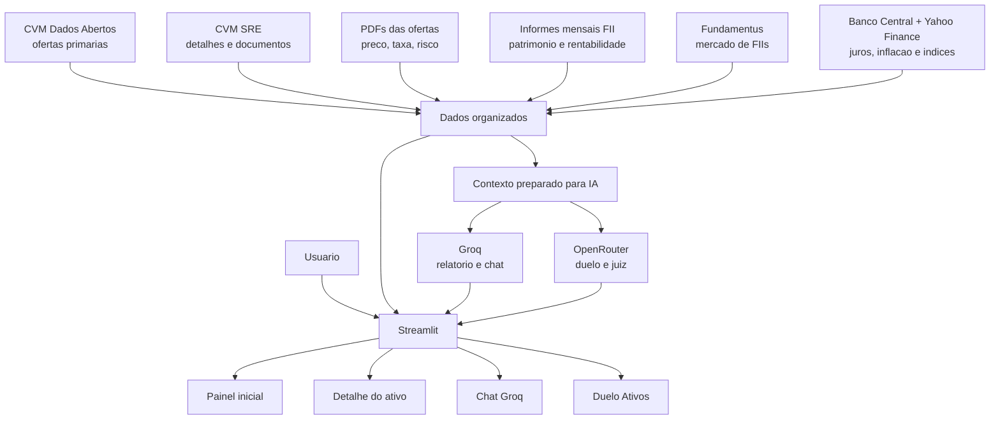
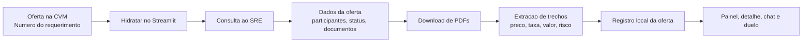
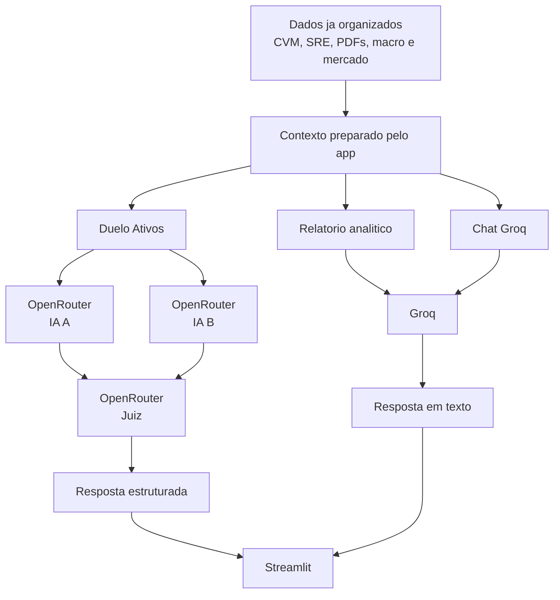

# Oferta.Ai: Fluxo do Projeto

Este documento explica como o Oferta.Ai funciona de ponta a ponta. A ideia aqui nao e abrir cada detalhe interno, mas mostrar o caminho que a informacao percorre: de onde os dados saem, como sao enriquecidos, como chegam nas telas e onde a inteligencia artificial entra.

## Visao Geral

O Oferta.Ai e um painel em Streamlit para acompanhar ofertas primarias, FIIs, CRI, CRA, debentures, IPOs e indicadores macroeconomicos. Ele junta varias fontes publicas em uma experiencia unica:

- CVM Dados Abertos, que traz a base principal de ofertas primarias.
- CVM SRE, que aprofunda uma oferta especifica com participantes, documentos e informacoes complementares.
- PDFs das ofertas, quando existem, para buscar preco, taxa, remuneracao, valor e riscos.
- Informes mensais de FIIs da CVM, usados em dados patrimoniais e comparacoes.
- Fundamentus, usado como apoio para dados de mercado dos FIIs.
- Banco Central e Yahoo Finance, usados para Selic, CDI, inflacao e indices como IFIX, IMOB e Ibovespa.
- Groq e OpenRouter, usados apenas na camada de inteligencia artificial.

O ponto central da arquitetura e separar dado de interpretacao. Primeiro o projeto busca e organiza os dados. Depois a IA entra para explicar, comparar ou responder perguntas. A IA nao deve inventar um campo quando a fonte nao trouxe a informacao.

## Mapa Principal



Em termos simples: o Streamlit e a vitrine. A CVM e a espinha dorsal. O SRE e os PDFs aprofundam as ofertas. As fontes de mercado e macro dao contexto. A IA entra no final, lendo o que ja foi preparado.

## O Caminho dos Dados

### 1. A Base CVM

O primeiro passo e baixar a base oficial de ofertas de distribuicao da CVM. Dela saem os registros de ofertas primarias que alimentam as abas de FII, CRI, CRA, Debentures e IPO.

CDB, LCI, LCA e Tesouro Direto nao ficam no painel porque nao pertencem a essa base de ofertas primarias usada pelo projeto. Manter essas abas criaria a impressao de que existe dado onde a fonte oficial nao entrega esse tipo de informacao.

### 2. O Enriquecimento pelo SRE

A base aberta da CVM mostra o quadro geral da oferta, mas nem sempre traz todos os detalhes que o usuario quer ver. Por isso existe a hidratacao pelo SRE. Quando o usuario clica para hidratar, o app procura dados complementares da oferta, baixa documentos quando existem e tenta extrair informacoes relevantes dos PDFs.



Esse fluxo explica por que alguns campos podem aparecer como `N/D`. As vezes a taxa ainda nao foi definida, esta em bookbuilding, nao aparece de forma clara no documento ou ainda nao foi hidratada localmente. Nesses casos, o correto e mostrar que o dado nao foi encontrado, e nao pedir para a IA preencher no chute.

### 3. Contexto de Mercado

O projeto tambem carrega informacoes de apoio:

- Informes mensais de FIIs ajudam a montar historico patrimonial, rentabilidade e comparacao com indices.
- Fundamentus ajuda a trazer cotacao, dividend yield, P/VP, liquidez e ranking de FIIs.
- Banco Central e Yahoo Finance trazem o pano de fundo macroeconomico: Selic, CDI, IPCA, IGP-M, IFIX, IMOB e Ibovespa.

Esses dados nao substituem a analise da oferta. Eles ajudam a entender o ambiente em que a oferta esta acontecendo.

## As Telas do App

### Painel Inicial

E a entrada principal. Mostra o contexto macro, as abas por produto, tabelas de ofertas, hidratacao SRE, analises individuais e relatorio Groq.

### Detalhe do Ativo

E uma tela mais comparativa. Para FII, mostra versus indices e radar de FIIs. Para CRI, CRA, Debentures e IPO, mostra comparacoes de atividade de mercado, radar de ofertas e linha do tempo de bancos/coordenadores.

### Chat Groq

E uma conversa direta com os dados da plataforma. O usuario pergunta em linguagem natural e o app busca automaticamente os registros mais parecidos com a pergunta.

Quando a pergunta envolve taxas de bancos ou ativos, o chat prioriza as taxas e remuneracoes das ofertas primarias encontradas na CVM, no SRE e nos documentos da propria oferta. Ele nao usa mercado secundario como resposta padrao.

Exemplos de perguntas:

```text
Quais taxas de CRI aparecem para ofertas coordenadas pelo BTG?
```

```text
Compare as taxas encontradas nas ofertas de CRI coordenadas por BTG, Itau e Bradesco.
```

Se a taxa nao estiver nos dados carregados, o chat deve dizer isso de forma clara.

### Duelo Ativos

Compara duas ofertas do mesmo grupo. Uma IA defende o Ativo A, outra defende o Ativo B, e uma terceira IA julga a qualidade dos argumentos. Isso nao e recomendacao de investimento; e uma forma de organizar pontos fortes, fragilidades e lacunas de dados.

## Camada de Inteligencia Artificial

A IA fica concentrada em uma camada propria. O projeto usa LangChain apenas para organizar as instrucoes enviadas aos modelos, as chamadas de IA e as respostas estruturadas quando o resultado precisa voltar em formato mais previsivel. Ele nao usa agentes, memoria, RAG, banco vetorial, FAISS ou Chroma.



O Groq gera relatorios e responde ao chat. O OpenRouter e usado no duelo, porque ali faz sentido comparar modelos diferentes e depois pedir para um juiz estruturar o resultado.

## Configuracoes Importantes

As chaves ficam no `.env`. As mais importantes sao:

```text
GROQ_API_KEY=
GROQ_REPORT_MODEL=
OPENROUTER_API_KEY=
OPENROUTER_DEBATE_MODEL_1=
OPENROUTER_DEBATE_MODEL_2=
OPENROUTER_JUDGE_MODEL=
CVM_SRE_BASE_URL=
ANBIMA_CLIENT_ID=
ANBIMA_CLIENT_SECRET=
```

O Groq rele a chave do `.env` na hora da chamada. Isso evita que o app continue preso em uma chave antiga quando ela e trocada manualmente.

## Dificuldades do Projeto

### Dados Publicos Nao Vem Prontos

Cada fonte fala de um jeito. A CVM usa arquivos grandes, o SRE traz dados mais profundos, PDFs podem ter tabelas dificeis, o Fundamentus vem de HTML e os indicadores macro chegam por APIs diferentes. O trabalho do projeto e transformar tudo isso em uma leitura unica.

### PDFs Nem Sempre Entregam a Taxa

Taxa, remuneracao e preco de emissao podem aparecer em documentos posteriores, tabelas complexas ou campos ainda indefinidos. Quando isso acontece, o app deve mostrar `N/D` ou explicar que nao encontrou o dado.

### IA Ajuda, Mas Nao Substitui a Fonte

A IA e boa para resumir, comparar e explicar. Mas ela nao deve criar taxa, preco, emissor ou conclusao sem base nos dados. Por isso o chat e os relatorios sao alimentados por contexto preparado pelo proprio app.

### Comparar Produtos Diferentes Exige Cuidado

FIIs tem historico patrimonial e de rentabilidade mensal. CRI, CRA, Debentures e IPO nao tem o mesmo tipo de serie dentro do projeto. Por isso algumas comparacoes mostram atividade de emissao ou atributos da oferta, nao rentabilidade do ativo.

## Limites Atuais

- O app nao e recomendacao de investimento.
- Taxas de oferta dependem de a CVM, o SRE ou o PDF trazerem essa informacao.
- Se a oferta nao foi hidratada, o chat pode nao encontrar detalhes como taxa, preco ou fatores de risco.
- O radar ajuda a comparar atributos, mas nao mede risco total.
- Groq e OpenRouter dependem de chave e disponibilidade externa.
- ANBIMA permanece como apoio/auditoria e nao e usada como resposta padrao para taxas de mercado secundario.

## Resumo

O Oferta.Ai organiza dados publicos de ofertas, FIIs e macroeconomia em um painel unico. A CVM e a base principal. O SRE e os PDFs enriquecem as ofertas. O mercado e a macro ajudam a dar contexto. A IA entra depois, para explicar e comparar o que ja foi encontrado.

A regra mais importante do projeto e simples: quando o dado existe, o app tenta mostrar e explicar. Quando nao existe, ele deve admitir a ausencia em vez de inventar.
